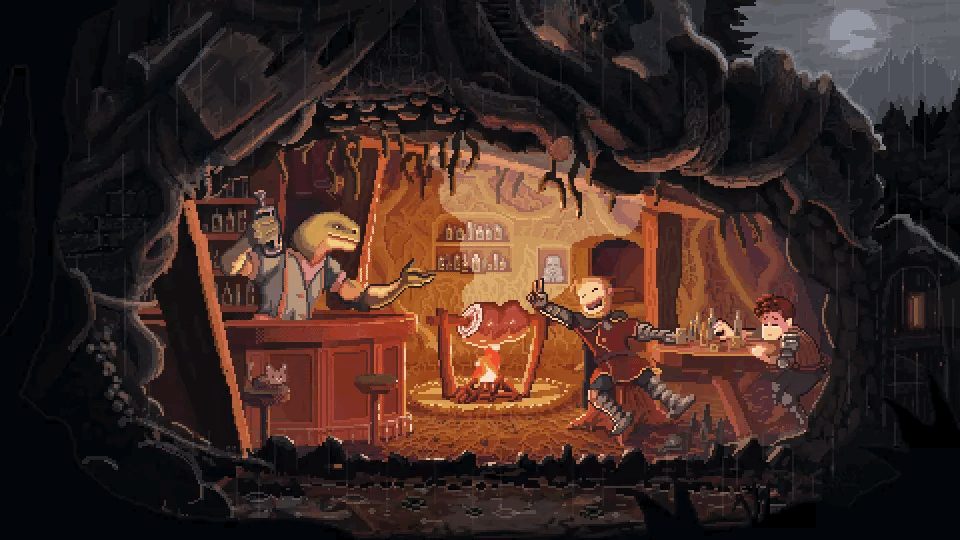

# ⚔️ Welcome to My Digital Domain ⚔️

<div align="center">
  <!-- Medieval Waterfall Header Banner -->

  <!-- Name & Role with medieval typing effect -->
<h1 align="center">
  
</h1>
</div>

---

## 🎯 Developer Profile & Expertise

<table>
<tr>
<td width="50%">

### ⚔️ Professional Overview

```python
class EvanWilliam:
    def __init__(self):
        self.name = "Evan William"
        self.location = "Indonesia 🇮🇩"
        self.role = "Software Developer"
        self.education = "Informatics Engineering @ UKWMS"
        self.status = "Student & Developer"
        
    def current_focus(self):
        return [
            "🧙‍♂️ Machine Learning Engineering",
            "📜 Data Science & Analytics", 
            "🏰 Full-Stack Development"
        ]
    
    def tech_stack(self):
        return {
            "languages": ["Python", "JavaScript", 
                         "C++", "PHP", "SQL"],
            "specialties": ["AI/ML", "Data Analysis", 
                           "Web Development"],
            "mindset": "Continuous Learning"
        }
    
    def philosophy(self):
        return "Innovation through code ⚔️"

# Initialize Developer
evan = EvanWilliam()
print(evan.philosophy())
```

</td>
<td width="50%">

<div align="center">

</div>

### 📍 Professional Details

- 🌍 **Location**: Indonesia 🇮🇩
- 🎓 **Education**: Informatics Engineering @ UKWMS
- 🎯 **Focus Areas**: Machine Learning, Data Science, Web Development
- 🔮 **Passion**: AI & Technology Innovation
- 🤝 **Status**: Open to collaboration

<div align="center">

</div>

</td>
</tr>
</table>

### 🏆 GitHub Achievements

<div align="center">

</div>

---

<!-- Medieval Scene Strip -->
<div align="center">

</div>

---

## 🛡️ Technical Arsenal & Tools

<div align="center">

### Programming Languages & Core Technologies
<p>


</p>

### Machine Learning & Data Science Stack
<p>


</p>

### Development Tools & Platforms
<p>


</p>

</div>

<div align="center">

</div>

---

<!-- Underground Cavern Scene -->
<div align="center"> 
  
</div>

---

## 🏆 Featured Project

<div align="center">

### ⚔️ Main Portfolio Repository

<a href="https://github.com/evan-william/personal-project">

</a>

</div>

<div align="center">

</div>

---

## 📊 Development Statistics

<div align="center">

### 🏆 GitHub Overview & 📈 Language Distribution

<table>
<tr>
<td width="55%">


</td>
<td width="45%">


</td>
</tr>
</table>

### 📅 Contribution Activity


---

## 🎯 Current & Future Objectives

<div align="center">

</div>

<div align="center">
<table>
<tr>
<td width="33%" align="center">

### 🧙‍♂️ AI & Machine Learning
- Deep Learning Architecture
- Model Development & Optimization
- Data Preprocessing & Feature Engineering
- Neural Network Implementation
- MLOps & Production Deployment
- Research & Experimentation

<div align="center">

</div>

</td>
<td width="33%" align="center">

### 📜 Data Science & Analytics
- Statistical Analysis & Modeling
- Data Visualization & Insights
- Interactive Dashboard Development
- Predictive Analytics
- Business Intelligence
- Research Methodology

<div align="center">

</div>

</td>
<td width="33%" align="center">

### 🏰 Software Development
- Full-Stack Application Development
- Content Management Systems
- Responsive Web Design
- Framework Integration
- Database Architecture
- API Development

<div align="center">

</div>

</td>
</tr>
</table>
</div>

---

## 🤝 Professional Network

<div align="center">

</div>

### 📬 Get In Touch

<div align="center">

[](https://www.linkedin.com/in/evanwilliam03/)
[](mailto:evanwilliam303@gmail.com)
[](https://github.com/evan-william)

</div>

<div align="center">

</div>

---

<div align="center">

</div>

<div align="center">

### 👀 Profile Views


### ⚔️ Thanks for Visiting!


**Ready to collaborate and build amazing solutions together! ⚔️**

</div>
