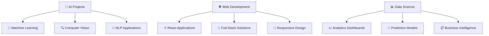

# <div align="center">🌌 WELCOME TO THE DIGITAL REALM OF EVAN WILLIAM 🌌</div>

<div align="center">
  
</div>

<div align="center">
  
</div>

## <div align="center">🎭 THE LEGEND BEHIND THE CODE 🎭</div>

<table align="center">
<tr>
<td width="50%">

### 🎯 **MISSION CONTROL**
```python
class EvanWilliam:
    def __init__(self):
        self.name = "Evan William"
        self.role = "Digital Alchemist"
        self.location = "Indonesia 🇮🇩"
        self.education = "Informatics Engineering @ UKWMS"
        self.languages = ["Python", "JavaScript", "PHP", "SQL", "C++"]
        self.superpowers = [
            "🔮 Machine Learning Wizardry",
            "🌐 Web Development Mastery",
            "📊 Data Science Sorcery",
            "🤖 AI Innovation",
            "⚡ Problem Solving Ninja"
        ]
    
    def current_focus(self):
        return "Building the future, one commit at a time 🚀"
```

</td>
<td width="50%">

### 🎪 **STATS CIRCUS**
<div align="center">
  
</div>

### 🎨 **CREATIVITY METER**
```
Innovation     ████████████ 100%
Problem Solving ███████████  95%
Code Quality   ██████████   90%
Team Spirit    █████████    85%
Coffee Intake  ████████████ ∞%
```

</td>
</tr>
</table>

---

## <div align="center">🛠️ ARSENAL OF DESTRUCTION 🛠️</div>

<div align="center">
  
  <br/>
  
  <br/>
  
</div>

<div align="center">
  
</div>

---

## <div align="center">🎮 GITHUB BATTLE ARENA 🎮</div>

<div align="center">
  
### 🏆 **CHAMPION STATISTICS**


### 🔥 **STREAK OF LEGENDS**


### 🐍 **CONTRIBUTION SNAKE GAME**
<picture>
  <source media="(prefers-color-scheme: dark)" srcset="https://raw.githubusercontent.com/platane/platane/output/github-contribution-grid-snake-dark.svg">
  <source media="(prefers-color-scheme: light)" srcset="https://raw.githubusercontent.com/platane/platane/output/github-contribution-grid-snake.svg">
  
</picture>

### 🎯 **ACTIVITY PULSE**


</div>

---

## <div align="center">🚀 FEATURED MASTERPIECE 🚀</div>

<div align="center">
  <a href="https://github.com/evan-william/personal-project">
    
  </a>
</div>

<div align="center">

### 🎪 **PROJECT SHOWCASE CAROUSEL**
```
🤖 Machine Learning Models    🌐 Web Applications    📊 Data Visualizations
        ↗️                           ↗️                        ↗️
    Neural Networks           Full-Stack Projects       Interactive Dashboards
    Computer Vision          E-commerce Solutions       Business Intelligence
    NLP Applications         CMS Development            Predictive Analytics
```

</div>

---

## <div align="center">💫 CODING PHILOSOPHY 💫</div>

<table align="center">
<tr>
<td>

```python
# My Coding Mantra
while True:
    learn_something_new()
    code_with_passion()
    solve_real_problems()
    share_knowledge()
    make_world_better()
    if success:
        celebrate()
    else:
        debug_and_retry()
```

</td>
<td>

<div align="center">
  
</div>

</td>
</tr>
</table>

---

## <div align="center">🌟 ACHIEVEMENT UNLOCKED 🌟</div>

<div align="center">
  
[](https://github.com/ryo-ma/github-profile-trophy)

### 🏅 **SKILL BADGES COLLECTION**


</div>

---

## <div align="center">🎭 CURRENT PROJECTS SPOTLIGHT 🎭</div>

<div align="center">
  
</div>



---

## <div align="center">🎪 CONNECT & COLLABORATE 🎪</div>

<div align="center">
  
### 🌈 **FIND ME IN THE DIGITAL UNIVERSE**

[](https://www.linkedin.com/in/evanwilliam03/)
[](mailto:evanwilliam303@gmail.com)
[](https://github.com/evan-william)

### 🤝 **COLLABORATION OPPORTUNITIES**
```
🎯 Open Source Contributions    🚀 Innovative Projects    🌟 Knowledge Sharing
🤖 AI/ML Research              📊 Data Science          🌐 Web Development
```

</div>

---

<div align="center">
  
### 🎊 **VISITOR COUNTER** 🎊


### 🎭 **RANDOM DEV QUOTE**


</div>

---

<div align="center">
  
</div>

<div align="center">
  
### 🚀 **"CODE. CREATE. INNOVATE. REPEAT."** 🚀
*Building tomorrow's solutions with today's passion* ✨

</div>

---

<div align="center">
  <sub>💫 Made with lots of ☕, 🎵, and endless curiosity by <strong>Evan William</strong> 💫</sub>
</div>
